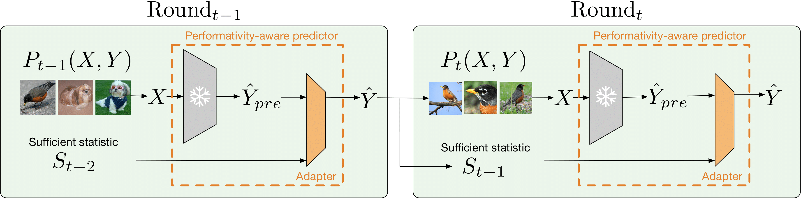

# ADJUSTING PRETRAINED BACKBONES FOR PERFORMATIVITY
We provide our implementation for PaP (Performativity-aware Predictor).



### Install Environment
Create a conda environment 
```shell
    conda create -n PaP python=3.10
    conda activate PaP
```

Please install packages with `pip install -r requirements.txt`

### Setup tllib 
Clone the repository [tllib](https://github.com/thuml/Transfer-Learning-Library)
Put the additional datasets files provided under PaP/datasets/ folder into Transfer-Learning-Library/tllib/vision/datasets directory (together with the __init__.py, also please add the dataset names into the dictionary, and include the imports)


### Run Scripts
You can reproduce our experiments in our paper with commands `./scripts/<exp_type>/<exp_name>`.

### Directory Structure
The directory structure should look like below
```
PaP/
|–– datasets/
|   |–– __init__.py
|   |–– agnews.py
|   |–– amazon.py
|   |–– cifar.py
|   |–– imagenet100.py
|   |–– terraincognita.py
|–– scripts/
|   |–– additional_domain_shift
|   |–– language
|   |–– model_switching
|   |–– vision
|–– architectures.py
|–– main.py
|–– nlp_utils.py
|–– performative_util.py
|–– utils.py
|–– requirements.txt
```

```BibTeX
@misc{demirel2024adjusting,
      title={Adjusting Pretrained Backbones for Performativity}, 
      author={Berker Demirel and Lingjing Kong and Kun Zhang and Theofanis Karaletsos and Celestine Mendler-Dünner and Francesco Locatello},
      year={2024},
      eprint={2410.04499},
      archivePrefix={arXiv},
      primaryClass={cs.LG},
      url={https://arxiv.org/abs/2410.04499}, 
}
```
